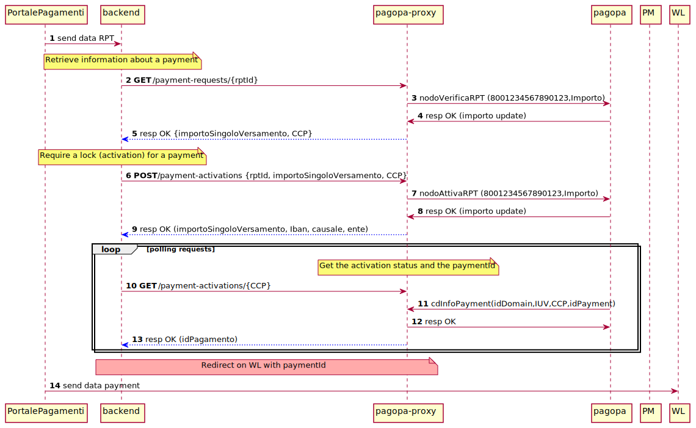
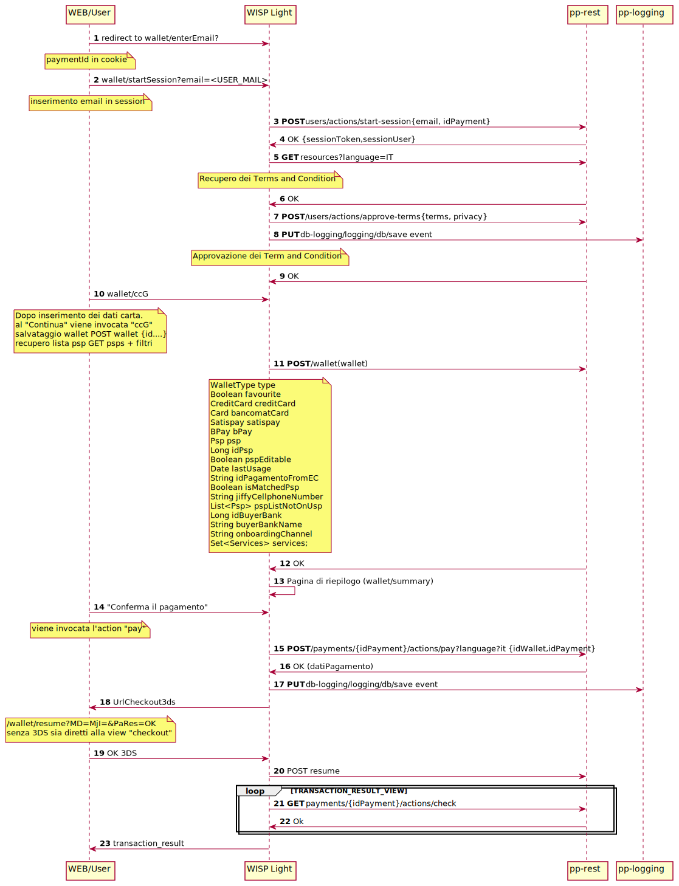

# io-pay-portal

- [io-pay-portal](#io-pay-portal)
  - [Infrastructure](#infrastructure)
    - [Public endpoint](#public-endpoint)
  - [Code coverage and CI/CD status](#code-coverage-and-cicd-status)
  - [Sequence diagram : _Partale Pagamenti_](#sequence-diagram--partale-pagamenti)
  - [Sequence diagram : _WISP light_](#sequence-diagram--wisp-light)

## Infrastructure
The infrastructure decided for the `io-pay-portal` project has been defined [here](https://github.com/pagopa/io-infrastructure-live-new/pull/363) 

How it's integrated into the [IO](https://io.italia.it/) system see [here](https://excalidraw.com/#room=82cbf71c24b07f891902,Dl6JQ8FcjKLoDzOZ5Iz8Ew)
### Public endpoint

- [io-pay-portal (fe)](https://io-p-cdnendpoint-iopayportal.azureedge.net/)
- io-pay-portal (be)
  - [verify](https://api.io.italia.it/api/payportal/v1/payment-requests/{rptID})
  - [activate](https://api.io.italia.it/api/payportal/v1/payment-activations)
  - [getPayment](https://api.io.italia.it/api/payportal/v1/{codiceContestoPagamento})

## Code coverage and CI/CD status

| code review | io-pay-portal | fe-deploy | be-deploy |
| :-------------: |:-------------:|:-------------:|:-------------:|
|| |  |

<!-- 

plantuml -tsvg README.md 

-->

## Sequence diagram : _Partale Pagamenti_
<!-- 
@startuml docs/media/seqdiag-portalepagamenti

autonumber 
participant portale  as "PortalePagamenti"
participant be as "backend"
participant proxy as "pagopa-proxy"
participant pagopa
participant pm as "PM"
participant wl as "WL"

portale -> be : send data RPT

note over be:  Retrieve information about a payment

be -> proxy : **GET** /payment-requests/{rptId}

proxy -> pagopa : nodoVerificaRPT (8001234567890123,Importo)
pagopa -> proxy : resp OK (importo update)

proxy -[#blue]-> be : resp OK {importoSingoloVersamento, CCP}

note over be:  Require a lock (activation) for a payment

be -> proxy : **POST** /payment-activations {rptId, importoSingoloVersamento, CCP}

proxy -> pagopa : nodoAttivaRPT (8001234567890123,Importo)
pagopa -> proxy : resp OK (importo update)

proxy -[#blue]-> be : resp OK (importoSingoloVersamento, Iban, causale, ente)

loop polling requests
note over proxy:  Get the activation status and the paymentId

be -> proxy : **GET** /payment-activations/{CCP}

pagopa -> proxy : cdInfoPayment(idDomain,IUV,CCP,idPayment)

proxy -> pagopa : resp OK

proxy -[#blue]-> be : resp OK (idPagamento)
end

note over be, proxy #FFAAAA: Redirect on WL with paymentId

portale -> wl : send data payment

@enduml 
-->

## Sequence diagram : _WISP light_

[Here](https://io-p-cdnendpoint-iopay.azureedge.net/index.html?p=12112) the public endpoint to io-pay (alias _Wisp Light_)

<!-- 
@startuml docs/media/seqdiag-wisplight

autonumber 
participant web as "WEB/User"
participant wl as "WISP Light"
participant api as "pp-rest"
participant logging as "pp-logging"

web -> wl : redirect to wallet/enterEmail?
note over web: paymentId in cookie

web -> wl : wallet/startSession?email=<USER_MAIL>
note over web: inserimento email in session

wl -> api : **POST** users/actions/start-session{email, idPayment}
api -> wl : OK {sessionToken,sessionUser}

wl -> api : **GET** resources?language=IT 
note over wl: Recupero dei Terms and Condition

api -> wl : OK

wl -> api : **POST** /users/actions/approve-terms{terms, privacy}

wl -> logging : **PUT** db-logging/logging/db/save event

note over wl: Approvazione dei Term and Condition

api -> wl : OK

web -> wl : wallet/ccG 

note over web: Dopo inserimento dei dati carta.\nal "Continua" viene invocata "ccG"\nsalvataggio wallet POST wallet {id....}\nrecupero lista psp GET psps + filtri

wl -> api : **POST** /wallet(wallet) 
note over wl:WalletType type\nBoolean favourite\nCreditCard creditCard\nCard bancomatCard\nSatispay satispay\nBPay bPay\nPsp psp\nLong idPsp\nBoolean pspEditable\nDate lastUsage\nString idPagamentoFromEC\nBoolean isMatchedPsp\nString jiffyCellphoneNumber\nList<Psp> pspListNotOnUsp\nLong idBuyerBank\nString buyerBankName\nString onboardingChannel\nSet<Services> services;

api -> wl : OK

wl -> wl : Pagina di riepilogo (wallet/summary)

web -> wl :"Conferma il pagamento" 
note over web: viene invocata l'action "pay"

wl -> api : **POST** /payments/{idPayment}/actions/pay?language?it {idWallet,idPayment}

api -> wl : OK (datiPagamento)

wl -> logging : **PUT** db-logging/logging/db/save event

wl -> web : UrlCheckout3ds 
note over web: /wallet/resume?MD=MjI=&PaRes=OK\nsenza 3DS sia diretti alla view "checkout"

web -> wl: OK 3DS

wl -> api : POST resume

loop TRANSACTION_RESULT_VIEW
wl -> api : **GET** payments/{idPayment}/actions/check

api -> wl : Ok 
end

wl -> web : transaction_result

@enduml 
-->

